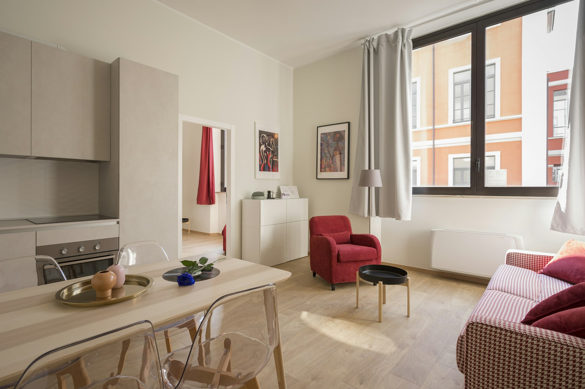

# 🏠 家务勇者 (Housework Hero)

[](https://github.com/RSGT945/HouseworkHero)
[](LICENSE)

> 把家务变成游戏闯关，让孩子爱上做家务！



## ✨ 功能特性

### 🎮 游戏化家务任务系统
- **四大任务场景**：卧室、客厅、卫生间、厨房
- **难度分级**：从1星到4星，循序渐进
- **角色成长**：等级系统 + 经验值 + 金币奖励

### 📸 清洁前后对比
- 上传打扫前后的照片进行对比
- AI智能识别整洁度（模拟）
- 生成对比图并保存

### 🦸 勇者面板
- **等级系统**：从"见习家务勇者"到"家园守护者"
- **成就徽章**：初出茅庐、油污克星、清洁大师
- **装扮商店**：用金币购买清洁手套、拖把武器、勇者制服

### 🔔 智能提醒
- 设置清洁提醒时间
- 浏览器通知提醒
- 自定义提醒内容

### 🎨 马卡龙风格UI
- 柔和的马卡龙配色方案
- 卡通可爱的视觉元素
- 流畅的动画效果

## 🚀 快速开始

### 在线体验
直接访问：[https://RSGT945.github.io/HouseworkHero](https://RSGT945.github.io/HouseworkHero)

### 本地运行
```bash
# 克隆仓库
git clone https://github.com/RSGT945/HouseworkHero.git

# 进入项目目录
cd HouseworkHero

# 启动本地服务器（任选其一）
# Python 3
python -m http.server 4000

# Node.js
npx serve

# 然后访问 http://localhost:4000
```

## 📱 兼容性

- ✅ Chrome / Edge / Firefox / Safari
- ✅ iOS Safari / Android Chrome
- ✅ 响应式设计，支持手机、平板、桌面端

## 🛠️ 技术栈

- **前端**：HTML5 + CSS3 + JavaScript (ES6+)
- **样式**：Tailwind CSS (CDN)
- **图标**：SVG 内联图标
- **存储**：LocalStorage 本地数据持久化

## 📁 项目结构

```
housework-hero/
├── index.html              # 主程序入口
├── compatibility-test.html # 兼容性测试页面
├── test.html               # 功能测试页面
├── images/                 # 图片资源
│   ├── bedroom_messy.jpg
│   ├── clean_2.jpg
│   ├── clean_3.jpg
│   ├── housework_result_1.jpg
│   ├── housework_result_4.jpg
│   ├── housework_result_5.jpg
│   └── messy_2.jpg
├── .trae/
│   └── documents/
│       └── ui_improvement_plan.md  # UI改进计划
└── README.md               # 项目说明
```

## 🎯 使用指南

### 1. 选择任务
点击任务卡片选择要完成的清洁任务（卧室、客厅、卫生间、厨房）

### 2. 上传照片
- 上传"打扫前"的照片
- 完成清洁后上传"打扫后"的照片

### 3. AI识别
点击"AI识别整洁度"按钮，系统会分析清洁效果并给出评分

### 4. 获得奖励
根据任务难度获得经验值和金币奖励

### 5. 升级成长
积累经验值提升等级，解锁新的称号和成就

### 6. 装扮勇者
在勇者面板使用金币购买装备和装扮

## 🧪 测试

### 功能测试
打开 `test.html` 查看自动化测试结果

### 兼容性测试
打开 `compatibility-test.html` 查看跨设备兼容性报告

## 📝 版本历史

### v1.0.0 (2026-03-29)
- ✨ 初始版本发布
- 🎮 完整的游戏化家务任务系统
- 📸 清洁前后对比功能
- 🤖 AI识别整洁度（模拟）
- 🦸 勇者等级与成就系统
- 🔔 智能提醒功能
- 🎨 马卡龙风格UI设计
- 📱 响应式布局支持

## 🤝 贡献

欢迎提交 Issue 和 Pull Request！

## 📄 许可证

本项目采用 [MIT](LICENSE) 许可证开源。

## 🙏 致谢

- 感谢 Tailwind CSS 提供的优秀样式框架
- 感谢所有测试用户的反馈和建议

---

**让家务变得有趣，让孩子爱上劳动！** 🌟
